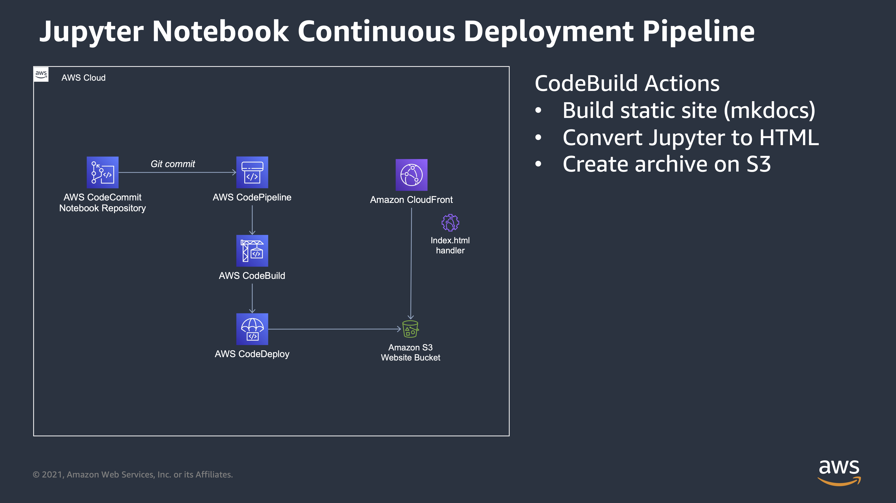

# Automatic Jupyter Notebook Deployer

After I re-joined the EMR team in Jan 2021, I've been doing a lot more work in Jupyter notebooks. 

I wanted a simple, elegant, and low-effort way to share those notebooks with the world, so I put together a continuous deployment notebook pipeline that can publish notebooks in a git repository to an S3-backed static website.

## Overview

This solution is based entirely on AWS services including CodeCommit, CodePipeline, CodeBuild, CodeCeploy, and CloudFront. 😅



## Deploying

**Make sure you have CDK and Python >= 3.9 installed.**

This project is a two-phased deploy due to the fact that CloudFront certificates need to be in `us-east-1`. If you _do not_ need a custom domain, you can skip the first part.

### Part 1 - CloudFront Certificate

This project only supports using the default CloudFront certificate and a DNS-validated CNAME. In order to generate the certificate, you'll need to run the command below, go into the AWS console and make sure you follow the validation instructions.

```shell
cdk deploy CloudfrontCertificateStack -c domain_name=notebooks.example.com
```

One of the outputs from this stack will be `CloudfrontCertificateStack.certificatearn` - you'll need the value of this for the next phase.

### Part 2 - Jupyter CD Pipeline

_If you are not using a custom domain, you can omit both of the `-c` options below._

```shell
cdk deploy EmrStudioPublisherStack -c domain_name=notebooks.example.com -c certificate_arn=arn:aws:acm:us-east-1:012345678912:certificate/f07b01a4-3e8c-4639-8a22-b7a20a832de3
```

Once this stack finishes, you should have a CodeCommit repository you can make changes to, a CloudFront distribution (the URL of which can be found in the `EmrStudioPublisherStack.cloudfrontendpoint` output), and a publicly accessible URL that has a pre-populated example site.

## Usage

Usage is pretty straight-forward. `git clone` the repository, make a change, and push it back up! 

Any new notebooks added in the `docs/notebooks/` directory will automatically be published. 

You can add links to the notebooks by updating the `nav` section of the `mkdocs.yml` file. 

### Advanced Usage

Note that not _all_ images or libraries render nicely when converting to HTML. This is why, for example, in my plotly example I had to use `fig.show(renderer="jupyterlab")`

## References

- https://medium.com/andy-le/building-a-dynamic-aws-pipeline-with-cdk-5d5426fc0493
- https://binarythinktank.com/blog/static-site-deployment-cdk-aws